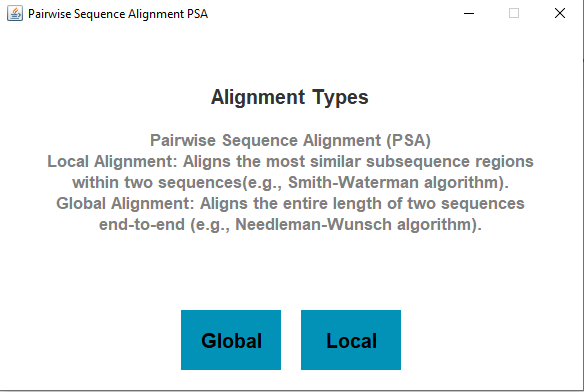

# Sequence Alignment Project

This project implements pairwise sequence alignment techniques including:
- Global alignment using the Needleman-Wunsch algorithm
- Local alignment using the Smith-Waterman algorithm

Both methods are implemented with fixed scoring values for match, mismatch, and gaps.

## Screenshots

